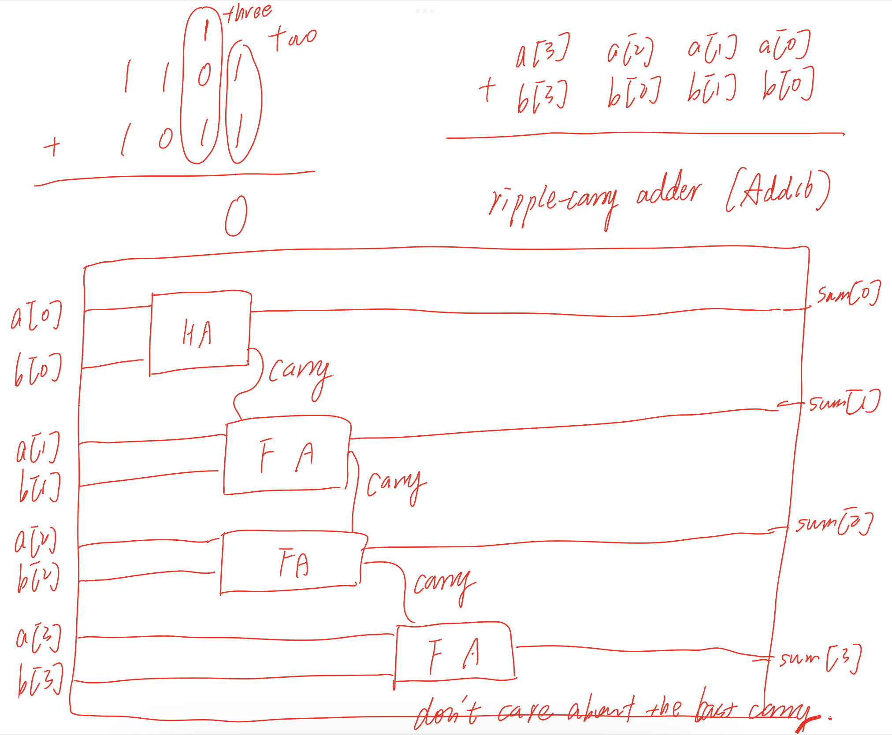

## Halfadder
Add two numbers, each number one bit  
carry: same truth table with And.  
sum: same truth table with Xor.

## FullAdder
Add three numbers, each number one bit  
carry: ab + a'bc + ab'c  
sum: if a = 0, sum = Xor(b, c); else sum = Xnor(b, c)

## Add16
Add two 16-bits values  


## Inc16
Pay attention to its grammar:  
```Add16(a=in, b[1..15]=false, b[0]=true, out=out);```

