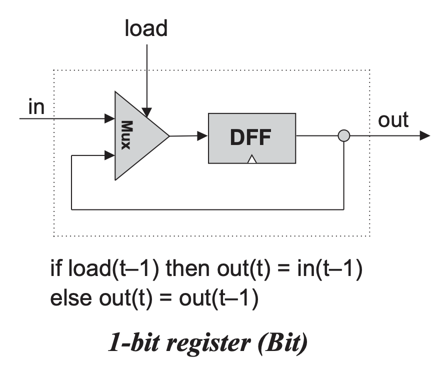

## Bit
DFF: outputs its input of t-1, i.e. out(t) = in(t - 1).  
If load == 0, "in" is passed to DFF by Mux, after 1 second, DFF outputs its input, which is in(t - 1).  
If load == 1, "out(t - 1)" is passed to DFF by Mux, after 1 second, DFF outputs its input, which is out(t - 1).  

## Register
Bit16

## RAM8
DMux8Way -> Register * 8 -> Mux8Way16

## RAM64
"_" is not allowed in the name of variables.

## For all RAMs
RAMx = RAMy * 8  
Let address[x] denotes the address of RAMx:  
DMux8Way (address[x-3..x-1]) -> RAMy (each address[0..x-4]) * 8 -> Mux8Way16 (address[x-3..x-1])  
address[x-3..x-1] is used to determine which RAMy.   
address[0..x-4] is used to pass as an argument to each RAMy.