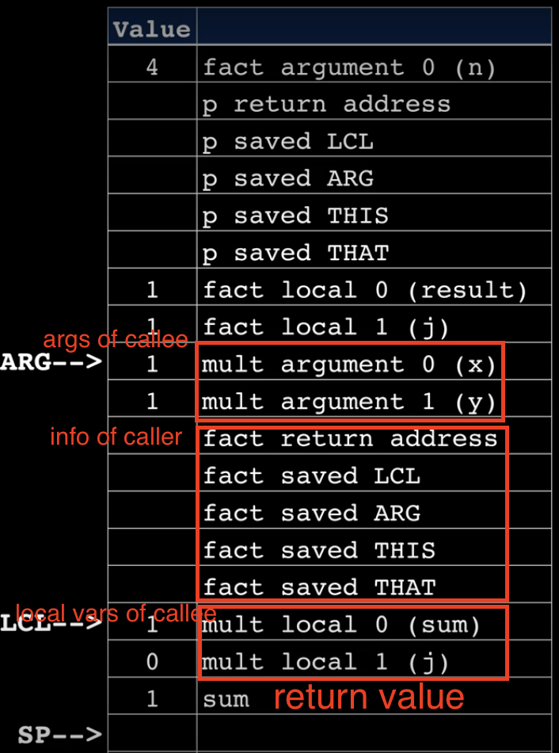
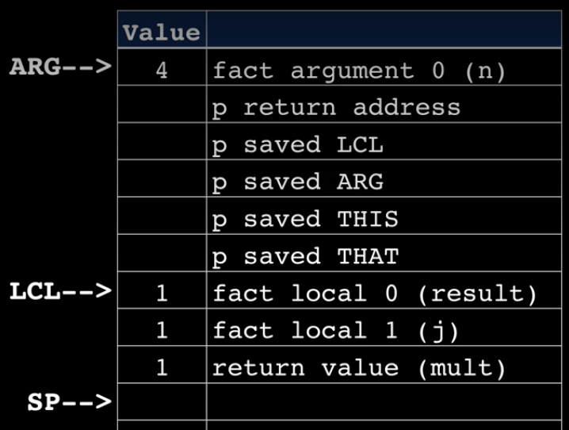

# VM Translator

## Memory access commands
### push: from segment to stack
1. Accessing symbolized segment  
   local, argument, this, that   
   VM code: ```push local 2```  
   Assembly code:  
   ```
   @LCL 
   D=M  // get the pointer's address
   @2
   A=D+A  // plus index to the pointer's address
   D=M
   @SP
   A=M
   M=D
   @SP
   M=M+1  // move sp one step forward
   ```
2. Accessing non-symbol segment  
   static, temp, pointer  
   VM code: ```push static 5```  
   Assembly code:  
   ```
   @<ClassName>.5
   D=M
   @SP
   A=M
   M=D
   @SP
   M=M+1
   ```
   VM code: ```push temp 2```  
   Assembly code:  
   ```
   @7  // temp start from 5; 5+2=7
   D=M
   @SP
   A=M
   M=D
   @SP
   M=M+1
   ```
   push pointer 0 => push this 0  
   push pointer 1 => push that 0
3. Constant
   VM code: ```push contant 3```  
   Assembly code:  
   ```
   @3  
   D=A  // 3 is not a pointer address
   @SP
   A=M
   M=D
   @SP
   M=M+1
   ```

### pop: from stack to segment
1. Accessing symbolized segment  
   VM code: ```pop local 4```  
   Assembly code:  
   ```
   @LCL
   D=M
   @4
   D=D+A
   @R13  // use R13 to temporarily store the address of local 4 because D will be used to store the sp's address
   M=D
   @SP
   AM=M-1
   D=M
   @R13
   A=M
   M=D
   ```
2. Accessing non-symbol segment  
   VM code: ```pop temp 3```  
   Assembly code:  
   ```
   @SP
   AM=M-1
   D=M
   @8
   M=D
   ```
3. "pop constant" does not exist


## Function

### Before calling  
1. Push all arguments of the callee to the stack 
2. Push return address (where to jump back to after callee finishes), caller's LCL (where are caller's local variables), ARG (where are caller's arguments), THIS, THAT to the stack
3. Reposition ARG to point to the first argument of the callee
4. Reposition LCL to point to the first local variable of the callee, i.e. current SP  
### Calling a function
1. Push all local variables of the callee to the stack and initialize them to 0
2. Execute the codes inside callee
### Function return
1. Make sure the return value is on the top of the stack
2. Pop the return value (top of the stack) into wherever the ARG is pointing to (where ARG is pointing to on the above image), i.e. the first argument of the callee.  

3. Pop the return value (first argument previously) to the local variable of the caller